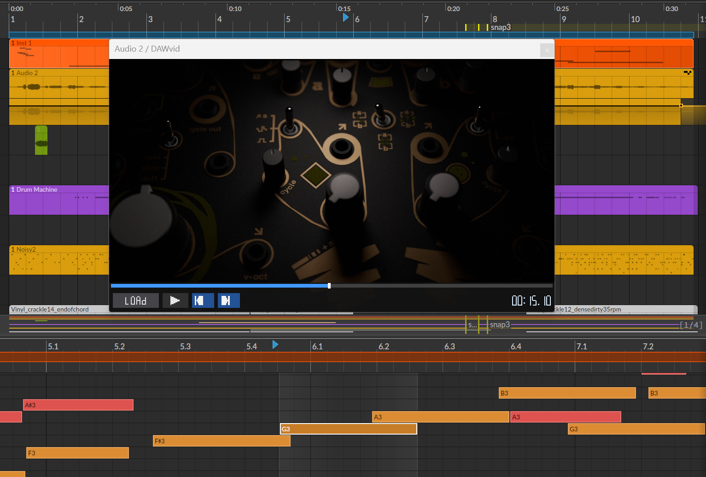

# DAWvid — CLAP Video Player Plugin

A CLAP plugin that plays a video file in sync with a DAW transport. Includes a companion Bitwig Controller Extension for full two-way sync with Bitwig Studio.

---



---

## Features

- **DAW → video sync** — reads `clap_event_transport` on every audio block; corrects drift > 50 ms with a hard seek.
- **Video → DAW seek** — scrubbing the video or stepping frames moves the DAW playhead via the companion controller extension (see below).
- **Stopped-playhead sync** — when Bitwig moves the caret while stopped (a quirk where CLAP plugins receive no notification), the companion extension detects the change and pushes it to the plugin so the video follows.
- **FFmpeg decoding** — MP4, MKV, MOV, AVI, and anything FFmpeg handles.
- **OpenGL 3.3 rendering** with correct letterboxing / pillarboxing.
- **Resizable embedded window** via the CLAP GUI extension.
- **State persistence** — the host saves and restores the open file path and position.

---

## Requirements

| Dependency | Version |
|---|---|
| CMake | ≥ 3.21 |
| C++ compiler | C++20 (GCC 12+, Clang 15+, MSVC 2022) |
| FFmpeg libraries | ≥ 5.0 (`libavcodec`, `libavformat`, `libavutil`, `libswscale`) |
| OpenGL | ≥ 3.3 |
| **Linux**: X11, GLX | system packages |
| **macOS**: Cocoa, OpenGL.framework | Xcode / CommandLineTools |
| **Windows**: WGL, WinSock2 | Windows SDK |

### Install FFmpeg dev libraries

```bash
# Ubuntu / Debian
sudo apt install libavcodec-dev libavformat-dev libavutil-dev libswscale-dev

# Arch
sudo pacman -S ffmpeg

# macOS (Homebrew)
brew install ffmpeg

# Windows — download a dev build from https://www.gyan.dev/ffmpeg/builds/
# Then pass -DFFMPEG_ROOT=<path> to CMake (see Build section).
```

---

## Build

```bash
git clone <this-repo>
cd DAWvid

# Linux / macOS
cmake -B build -DCMAKE_BUILD_TYPE=Release
cmake --build build --parallel

# Windows (set FFMPEG_ROOT to your extracted FFmpeg dev package)
cmake -B build -DCMAKE_BUILD_TYPE=Release -DFFMPEG_ROOT=C:/ffmpeg
cmake --build build --parallel
```

Install to your CLAP folder:
```bash
cmake --install build
# or:
cmake --build build --target install-plugin
```

---

## Install

### Windows — installer package (recommended)

```bash
cmake --build build --target dist
```

This produces `build/dist/DAWvid-install/`:

```
DAWvid-install/
  DAWvid.clap
  avcodec-62.dll
  avformat-62.dll
  avutil-60.dll
  swscale-9.dll
  install.bat       ← double-click to install
  install.ps1
```

**Double-click `install.bat`** — it copies everything to `C:\Program Files\Common Files\CLAP\` (the standard CLAP scan path). The FFmpeg DLLs go next to `DAWvid.clap` so the DAW finds them without PATH changes.

### Windows — manual install

```
C:\Program Files\Common Files\CLAP\
    DAWvid.clap
    avcodec-62.dll
    avformat-62.dll
    avutil-60.dll
    swscale-9.dll
```

### macOS

Copy `DAWvid.clap` (a bundle) to:
```
~/Library/Audio/Plug-Ins/CLAP/
```

FFmpeg must be installed (`brew install ffmpeg`).

### Linux

Copy `DAWvid.clap` to `~/.clap/` or `/usr/lib/clap/`.

---

## Bitwig Studio — companion controller extension

> **Why is this needed?**
> CLAP plugins are sandboxed — they can read the transport but cannot command the host to seek, play, or stop. Bitwig also has a quirk where it does not notify CLAP plugins when the user moves the playhead while stopped. The companion extension runs inside Bitwig with full Transport API access and bridges both limitations over a local UDP socket.

### Install the controller extension

1. Copy `bitwig/DAWvid.control.js` into Bitwig's controller scripts folder:

   | OS | Path |
   |---|---|
   | Windows | `%USERPROFILE%\Documents\Bitwig Studio\Controller Scripts\DAWvid\` |
   | macOS | `~/Documents/Bitwig Studio/Controller Scripts/DAWvid/` |
   | Linux | `~/Bitwig Studio/Controller Scripts/DAWvid/` |

2. In Bitwig Studio:
   - Open **Settings** (gear icon, top-right)
   - Go to **Controllers**
   - Click **Add controller**
   - In the controller list, find **DAWvid** under the manufacturer column
   - Select **DAWvid Bridge**
   - Click **Add**

   The entry appears as **DAWvid — DAWvid Bridge** in your controller list once added.

3. The extension and plugin discover each other automatically on `localhost`. No further configuration needed.

> The controller extension requires Bitwig 5 or later (GraalVM JS engine). It uses two loopback UDP ports: **47491** (controller listens) and **47492** (plugin listens). Both are loopback-only and not exposed to the network.

---

## Architecture

```
┌──────────────────────────────────────────────────────────────────────┐
│ Bitwig Studio                                                        │
│                                                                      │
│  ┌─────────────────────────────┐    ┌──────────────────────────────┐ │
│  │ CLAP plugin (DAWvid.clap)   │    │ Controller Extension          │ │
│  │                             │    │ (DAWvid.control.js)          │ │
│  │  audio thread               │    │                              │ │
│  │    process()                │    │  transport.playStartPosition │ │
│  │      TransportSync::update()│    │    .addValueObserver()  ─────┼─┼─► UDP 47492
│  │        ▼                   │    │                              │ │    "POS_BEATS n"
│  │      syncVideoToTransport() │◄───┼─── UDP 47492               │ │
│  │        ▼                   │    │    "POS_BEATS n"            │ │
│  │      VideoDecoder::seekTo() │    │                              │ │
│  │                             │    │  transport.isPlaying()       │ │
│  │  GUI thread                 │    │    .addValueObserver()  ─────┼─┼─► UDP 47492
│  │    scrub / step / play ─────┼────┼──► UDP 47491               │ │    "PLAYING/STOPPED"
│  │                             │    │    "SEEK_BEATS n"           │ │
│  │                             │    │      ▼                      │ │
│  │                             │    │    transport.setPosition()  │ │
│  └─────────────────────────────┘    └──────────────────────────────┘ │
│                                                                      │
│  VideoDecoder (background thread)                                    │
│    FFmpeg decode loop → DecodedFrame (RGBA) → shared_ptr             │
│                                                                      │
│  GLRenderer (GUI timer, 60 Hz)                                       │
│    uploads frame → GL texture → draws with aspect-ratio scaling      │
└──────────────────────────────────────────────────────────────────────┘
```

### Two-way sync in detail

**DAW → Video** (every audio block, audio thread):
1. `TransportSync::update()` reads `clap_process_t::transport`
2. Detects play/pause changes and position jumps > 50 ms
3. Calls `VideoDecoder::play()` / `pause()` / `seekTo()`

**Stopped-playhead fix** (IPC receive thread → audio thread):
1. User drags the Bitwig caret while transport is stopped
2. Controller extension sees `playStartPosition()` change, sends `POS_BEATS <n>` to the plugin
3. `IPCBridge` receive thread calls `TransportSync::injectPositionBeats()`, converts beats → seconds using the last known tempo, sets an atomic flag
4. Next `process()` call: flag is cleared, `syncVideoToTransport()` seeks the video

**Video → DAW** (GUI thread → controller extension):
1. User scrubs the video or clicks play/stop in the plugin window
2. `IPCBridge::sendSeekBeats()` / `sendPlay()` / `sendStop()` sends a UDP packet to the controller extension
3. Extension calls `transport.setPosition()` / `transport.play()` / `transport.stop()` — Bitwig's playhead moves

---

## IPC protocol

All messages are ASCII, newline-terminated, over loopback UDP.

| Direction | Message | Meaning |
|---|---|---|
| Controller → Plugin | `POS_BEATS <double>` | Caret moved while stopped |
| Controller → Plugin | `PLAYING` | Transport started |
| Controller → Plugin | `STOPPED` | Transport stopped |
| Plugin → Controller | `SEEK_BEATS <double>` | Video scrubbed to this beat |
| Plugin → Controller | `PLAY` | User clicked play in plugin |
| Plugin → Controller | `STOP` | User clicked stop in plugin |

Position values are in **beats** (quarter notes from the start of the arrangement), matching Bitwig's native timeline unit. The plugin converts to seconds using the last tempo reported by the CLAP transport.

---

## Platform status

| Platform | Plugin | Controller extension |
|---|---|---|
| **Windows (Win32 + WGL)** | ✅ Complete | ✅ JS (Bitwig 5+) |
| **Linux (X11 + GLX)** | ✅ Complete | ✅ JS (Bitwig 5+) |
| **macOS (Cocoa + NSOpenGL)** | 🔧 `setParent()` stub in `gui_window.cpp` | ✅ JS (Bitwig 5+) |

The UDP IPC code in `ipc_bridge.cpp` is cross-platform (WinSock2 on Windows, POSIX sockets on Linux/macOS).

---

## Source layout

```
src/
  plugin_entry.cpp       CLAP factory + DLL entry point
  video_player_plugin.cpp  Lifecycle, extensions, wires everything together
  video_decoder.cpp      FFmpeg decode loop (background thread)
  transport_sync.cpp     DAW↔video sync + IPC position injection
  gl_renderer.cpp        OpenGL 3.3 rendering, letterbox/pillarbox
  gui_window.cpp         Platform-native window (Win32/Cocoa/X11)
  ipc_bridge.cpp         UDP IPC bridge to companion controller extension

include/                 Matching headers

bitwig/
  DAWvid.control.js      Bitwig Controller Extension (install separately)
```
